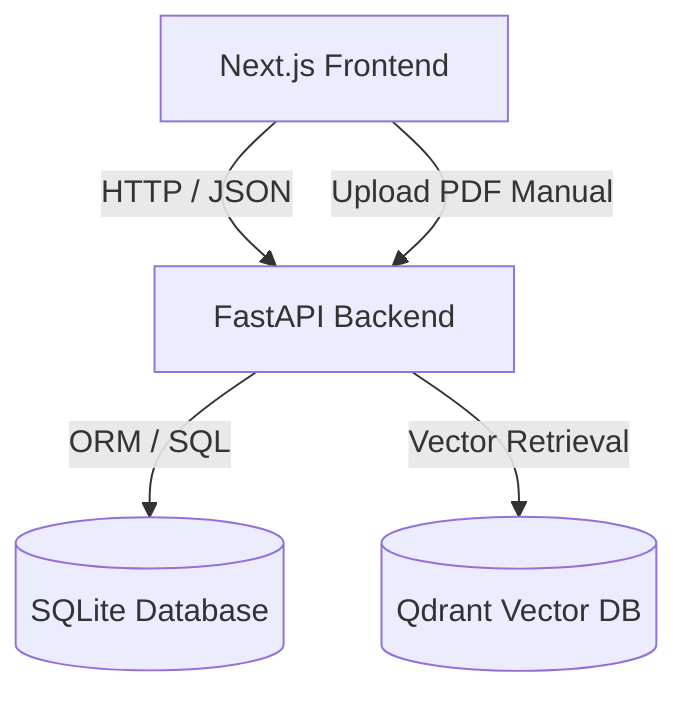

# Vehicle Copilot & Maintenance Dashboard

Vehicle Copilot is a modern, responsive, and AI-powered automotive maintenance application. It combines structured vehicle service logs with unstructured owners' manual documents (PDFs) to deliver hyper-accurate, context-aware diagnostic support and torque/fluid specifications via an AI Copilot chat.

---

## 🏗️ Architecture & Development Phases

The project was constructed across five cohesive phases:



1. **Phase 1: Environment & Backend Foundation**
   - Built a FastAPI application managed by `uv` for python environment efficiency.
   - Designed schema models (`Vehicle`, `ServiceLog`) using `SQLModel` (SQLAlchemy + Pydantic wrapper) backed by `SQLite`.

2. **Phase 2: Vector Store & Ingestion Pipeline**
   - Integrated `Qdrant` as the vector database for high-performance similarity search.
   - Built an ingestion service utilizing `PyPDFLoader` to parse owner manual PDFs, chunk text recursively, compute embeddings via OpenAI `text-embedding-3-small`, and index chunks tagged by `vehicle_id`.

3. **Phase 3: Hybrid Retrieval & RAG Copilot Engine**
   - Created the AI Copilot reasoning service using LangChain and `gpt-4o-mini`.
   - Utilizes **Hybrid Retrieval (RAG)**: Combines structured SQL query logs (past service history) and unstructured PDF manual excerpts retrieved from Qdrant to formulate safety-conscious, step-by-step diagnostic answers.

4. **Phase 4: Frontend Development**
   - Built a sleek, dark/slate automotive dashboard using Next.js 14+ (App Router), Tailwind CSS, Lucide icons, and TypeScript.
   - Contains dynamic active vehicle selectors, service history grids with search/filters, slide-over log creation drawers, Markdown-enabled conversational chat history, and drag-and-drop file progress bars.

5. **Phase 5: Containerization & Deployment**
   - Fully containerized the frontend, backend, and vector database services using multi-stage Docker builds and Docker Compose for easy single-command orchestration.

---

## 🛠️ Tech Stack
- **Frontend:** Next.js 14+ (App Router), React, Tailwind CSS (v4), TypeScript, Lucide React, React-Markdown.
- **Backend:** Python 3.12, FastAPI, SQLModel (SQLite), LangChain, OpenAI API.
- **Vector DB:** Qdrant.
- **Package Managers:** `npm` (Node), `uv` (Python).
- **Deployment:** Docker & Docker Compose.

---

## 🔑 Environment Variables Configuration

### 1. Backend Environment Setup (`backend/.env`)
Create a file named `.env` inside the `backend/` directory:

```ini
# OpenAI API Key for embeddings and chat generation
OPENAI_API_KEY="your-openai-api-key-here"

# Qdrant URL (defaults to localhost when running bare-metal)
QDRANT_URL="http://localhost:6333"
QDRANT_COLLECTION_NAME="vehicle_manuals"

# Optional: Qdrant cloud authentication key (leave empty for local docker)
QDRANT_API_KEY=""
```

### 2. Root Environment Setup (`.env`)
Create a file named `.env` in the root workspace directory for Docker Compose:

```ini
OPENAI_API_KEY="your-openai-api-key-here"
```

---

## 🚀 How to Run the Project

### Option A: Run via Docker Compose (Recommended)
This starts all three services (Qdrant, FastAPI backend, Next.js frontend) and links them together automatically on a bridge network.

1. Create a root `.env` containing your `OPENAI_API_KEY`.
2. Run the build and start command:
   ```bash
   docker compose up --build
   ```
3. Open your browser and navigate to:
   - **Frontend UI:** `http://localhost:3000`
   - **FastAPI API Docs:** `http://localhost:8000/docs`
   - **Qdrant Dashboard:** `http://localhost:6333/dashboard`

---

### Option B: Run Locally (Bare-Metal)

#### 1. Spin up the Qdrant Vector Store
Launch Qdrant using Docker:
```bash
docker run -p 6333:6333 -p 6334:6334 \
  -v $(pwd)/qdrant_storage:/qdrant/storage \
  qdrant/qdrant
```

#### 2. Start the FastAPI Backend
Navigate to the `backend` directory, set up your `.env`, and start the server:
```bash
cd backend
# Install dependencies and sync virtual environment using uv
uv sync
# Run the development server
.venv/bin/uvicorn app.main:app --host 0.0.0.0 --port 8000 --reload
```

#### 3. Start the Next.js Frontend
In a new terminal window, navigate to the `frontend` directory and start the dev server:
```bash
cd frontend
# Install npm dependencies
npm install
# Launch Next.js dev server
npm run dev
```
Open `http://localhost:3000` to interact with the dashboard.

---

## 📡 API Reference

The frontend communicates with the backend via the following FastAPI endpoints:

| Method | Endpoint | Description |
| :--- | :--- | :--- |
| `GET` | `/api/v1/vehicles/` | Lists all registered vehicles. |
| `POST` | `/api/v1/vehicles/` | Registers a new vehicle (`make`, `model`, `year`, `vin`, `current_mileage`). |
| `GET` | `/api/v1/logs/{vehicle_id}` | Fetches service logs for a specific vehicle. |
| `POST` | `/api/v1/logs/` | Creates a new maintenance log. |
| `POST` | `/api/v1/copilot/chat` | Queries the AI diagnostic assistant (`vehicle_id`, `question`). |
| `POST` | `/api/v1/documents/upload-manual` | Uploads and indexes a PDF manual (`vehicle_id`, `file` as multipart form). |
| `GET` | `/health` | Backend heartbeat check. |
